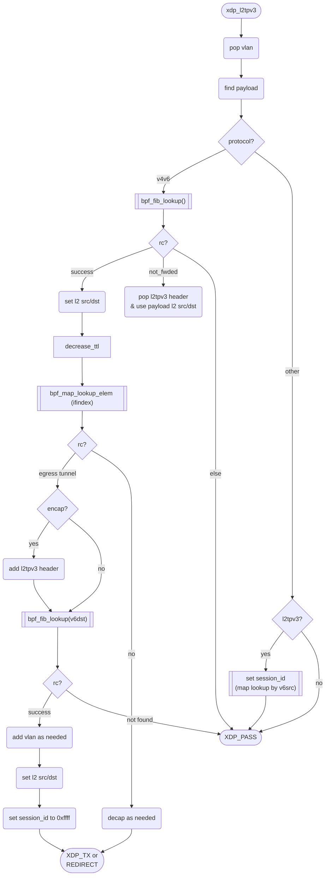

```mermaid
graph TD
start([xdp_l2tpv3]) --> pop(pop vlan)
pop --> payload(find payload)
payload --> proto{protocol?}
proto --> |v4v6| fib_lookup1[["bpf_fib_lookup()"]]
fib_lookup1 --> fib_lookup1_rc{rc?}
fib_lookup1_rc -->|success| setl2("set l2 src/dst")
fib_lookup1_rc -->|not_fwded| pop_l2tpv3("pop l2tpv3 header <br> & use payload l2 src/dst")
fib_lookup1_rc -->|else| xdp_pass
setl2 --> decrease_ttl
decrease_ttl --> map_lookup2[["bpf_map_lookup_elem (ifindex)"]]
map_lookup2 --> map_lookup2_rc{rc?}
proto -->|other| tunnel{"l2tpv3?"}
tunnel -->|yes| xdp_set_sid_action[["set session_id<br>(map lookup by v6src)"]]
xdp_set_sid_action --> xdp_pass
tunnel -->|no| xdp_pass([XDP_PASS])
map_lookup2_rc -->|egress tunnel| encap{"encap?"}
encap -->|yes| add_l2tpv3(add l2tpv3 header)
encap -->|no| fib_lookup2
map_lookup2_rc -->|no| decap("decap as needed")
decap --> xdp_tx_or_redirect([XDP_TX or <br> REDIRECT])
add_l2tpv3 --> fib_lookup2[["bpf_fib_lookup(v6dst)"]]
fib_lookup2 --> fib_lookup2_rc{rc?}
fib_lookup2_rc -->|success| add_swap_vlan("add vlan as needed")
add_swap_vlan --> set_l2("set l2 src/dst")
fib_lookup2_rc -->|not found| xdp_pass
set_l2 --> set_session_id("set session_id to 0xffff")
set_session_id --> xdp_tx_or_redirect

```

